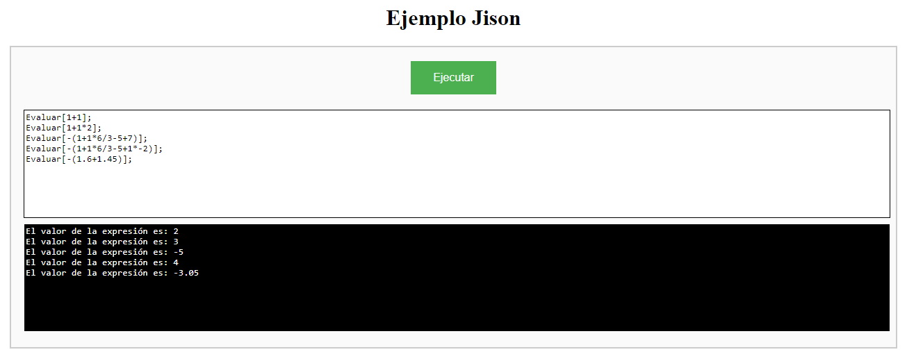

# Ejemplo de jison

Pequeño ejemplo de como utilizar la herramienta [Jison](https://github.com/zaach/jison) en la Web.

> Nota: Link para visualizar el ejemplo: https://neftxx.github.io/ejemplo-jison/
